# Task 1: ​Create a Model Inference Workflow with Prefect (Cinnie)
File 'Task_1.py' is the final version of the code.  
File 'Test_Step1.py' is the code for testing Step 1 (i.e. the function).  
File 'Test_Step2.py' is the code for testing Step 2 (i.e. the task).  
  
This readme file is to shows the detailed steps of the code, and how I test the code.  


## Table of Content
Steps:
  - [1. Create a Function](#1-create-a-function)
    - [I. Import Modules](#i-import-modules)
    - [II. Create a Function](#ii-create-a-function)
    - [III. Read Model Path](#iii-read-model-path)
    - [IV. Load Image](#iv-load-image)
    - [V. Preprocess Image](#v-preprocess-image)
    - [VI. Create Inference Session](#vi-create-inference-session)
    - [VII. Get Prediction (before softmax)](#vii-get-prediction-before-softmax)
    - [VIII. Get Probabilities (apply softmax)](#viii-get-probabilities-apply-softmax)
    - [IX. Return Result](#ix-return-result)
    - [Testing the Function](#testing-the-function)
  - [2. Create a Task](#2-create-a-task)
    - [I. Import Modules](#i-import-modules-1)
    - [II. Create a Task](#ii-create-a-task)
    - [III. Get Directories](#iii-get-directories)
    - [IV. Setup](#iv-setup)
    - [V. Get All Image Filenames](#v-get-all-image-filenames)
    - [VI. Loop & Run Model & Store Predictions & Move Processed Image](#vi-loop--run-model--store-predictions--move-processed-image)
    - [VII. Store in JSON format](#vii-store-in-json-format)
    - [VIII. Schedule the Task](#viii-schedule-the-task)
    - [IX. Create & Run the Flow](#ix-create--run-the-flow)
    - [Testing the Workflow](#testing-the-workflow)


## 1. Create a Function

### I. Import Modules
```
import onnxruntime                                                  # For running the onnx model
from keras.preprocessing.image import img_to_array, load_img        # For preprocessing the image input
from skimage.transform import resize                                # For resizing the image input
import numpy as np                                                  # For manipulating the image input
```
### II. Create a Function
Create a function that takes in an image:
```
def predictHelmetProb(image_path):
```
### III. Read Model Path
```
model_path = 'helmetfromperson_yesno_mobilenetv2_140_128x128_11-3-2021.onnx'
```
### IV. Load Image
```
img = load_img(image_path)
```
### V. Preprocess Image
```
ximg = img_to_array(img)                                        # Convert image to array
ximg128 = resize(ximg / 255, (128, 128, 3), anti_aliasing=True) # Resize the image to 128x128
ximg = ximg128[np.newaxis, :, :, :]                             # Add a new axis
ximg = ximg.astype(np.float32)                                  # Convert it to np float
ximg = np.swapaxes(ximg, 3,1)                                   # Adjusting the axes to meet the input requirement
```
### VI. Create Inference Session
```
session = onnxruntime.InferenceSession(model_path)
```
### VII. Get Prediction (before softmax)
```
input_name = session.get_inputs()[0].name
prediction_before_softmax = session.run(None, {input_name: ximg})
```
### VIII. Get Probabilities (apply softmax)
Create a function for softmax function:
```
def softmax(x):
    e_x = np.exp(x - np.max(x))
    return e_x / e_x.sum()
```
Run the softmax function with the output from the model:
```
wear_helmet_prob, not_wear_helmet_prob, undetermined_prob = softmax(prediction_before_softmax)[0][0]
```
### IX. Return Result
```
return wear_helmet_prob, not_wear_helmet_prob, undetermined_prob
```

### Testing the Function
Here's the whole code for the function & testing:
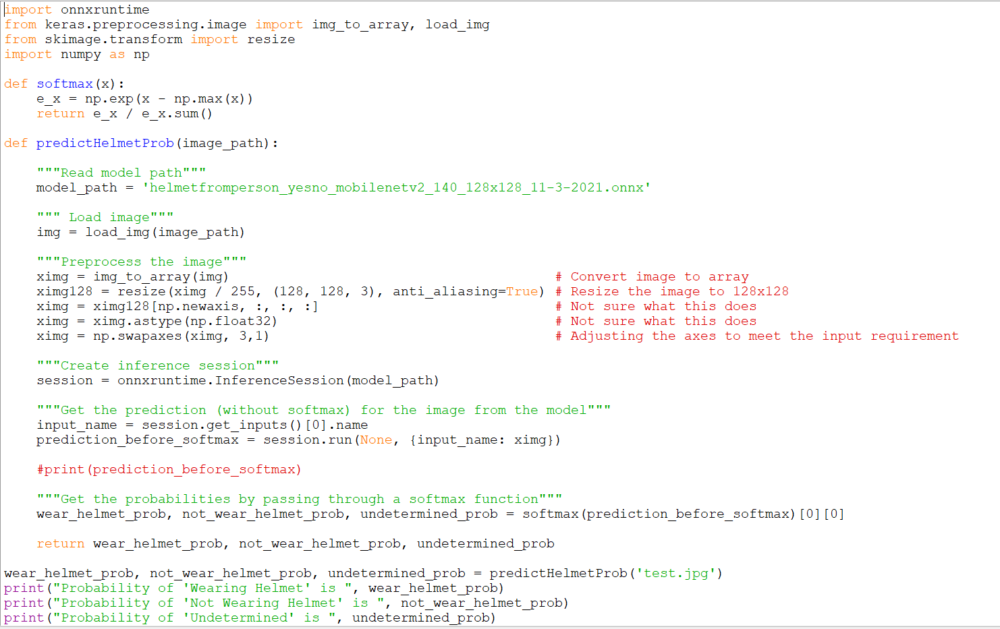  
The Test Image obtained from Google is as follow:  
  
And the Test Output for the function is shown below:
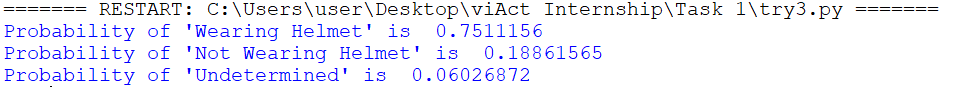  


## 2. Create a Task

### I. Import Modules
```
from prefect import task, Flow                                      # For workflow management
from pathlib import Path                                            # For moving processed image to another directory
import os                                                           # For manipulating file and directory path
import json                                                         # For storing in JSON format
from datetime import datetime, timedelta                            # For naming JSON file & scheduling task
from prefect.schedules import Schedule                              # For scheduling task
from prefect.schedules.clocks import CronClock                      # For scheduling task
```
### II. Create a Task
```
@task                       
def inferenceDirectory(): 
```
### III. Get Directories
Get user-specified directory path for unprocessed images:
```
directory = r'C:\Users\user\Desktop\viAct Internship\Task 1\image_data'
``` 
Get user-specified directory path for processed images:
```
new_directory = r'C:\Users\user\Desktop\viAct Internship\Task 1\processed_image_data'
```
### IV. Setup
Create a dictionary to store the predictions during runtime:
```
store_prob = {"predictions": []}
```
Create a list to store all filenames in the directory for unprocessed images:
```
file_name_list = []
```
### V. Get All Image Filenames
Get all image filenames in the filename list:
```
for filename in os.listdir(directory):
    if filename.endswith(".jpg") or filename.endswith(".png"):
        file_name_list.append(filename)
    else:
        continue
```
### VI. Loop & Run Model & Store Predictions & Move Processed Image
```
for filename in file_name_list:
```
Get the predictions from the model:
```
    wear_helmet_prob, not_wear_helmet_prob, undetermined_prob = predictHelmetProb(os.path.join(directory, filename))
```
Convert float to string in order to store as json later:
```
    wear_helmet_prob = str(wear_helmet_prob)            
    not_wear_helmet_prob = str(not_wear_helmet_prob)
    undetermined_prob = str(undetermined_prob)
```
Store prediction of image in dictionary:
```
    store_prob["predictions"].append({filename: [wear_helmet_prob, not_wear_helmet_prob, undetermined_prob]})
```
Move the processed image to new directory:
```
    Path(os.path.join(directory, filename)).rename(os.path.join(new_directory, filename))     
```
### VII. Store in JSON format
Convert the dictionary to json format: 
```
json_data = json.dumps(store_prob)
```
Get the datetime to name the json file for storing prediction every day:
```
name = datetime.utcnow().strftime('%Y-%m-%d %H_%M_%S.%f')[:-3]
json_file_name = "json_prediction_data/%s.json"% name
```
Create a new json file for the prediction result:
```
with open(json_file_name, 'x') as json_file:
    json.dump(json_data, json_file)

```
### VIII. Schedule the Task
Schedule the flow so that the task will run at 2am every day:
```
schedule = Schedule(clocks=[CronClock("0 2 * * *")])
```
### IX. Create & Run the Flow
Create a flow that run the task:
```
with Flow('ModelInferenceWorkflow', schedule) as flow:
    inferenceDirectory()
```
Run the flow:
```
flow.run()
```

### Testing the Workflow
Here's the whole code for the workflow:
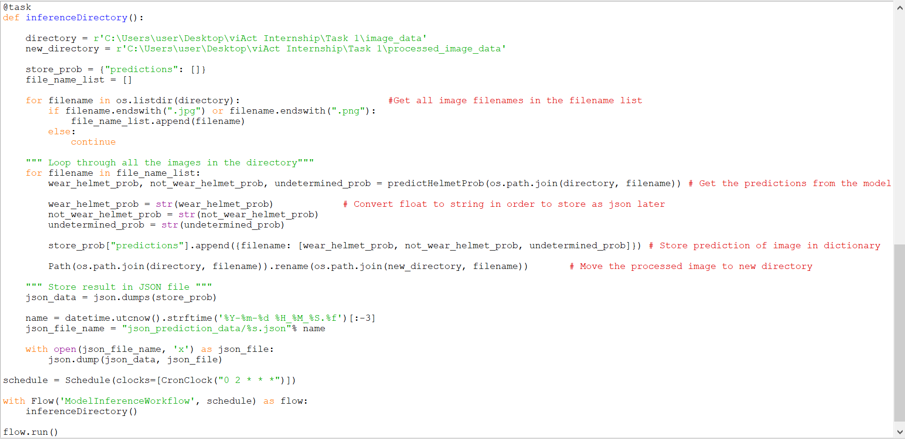 
And the output for this code is:
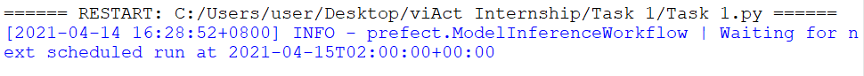

For testing, I remove the scheduling feature of the workflow.  
Here's the test code:
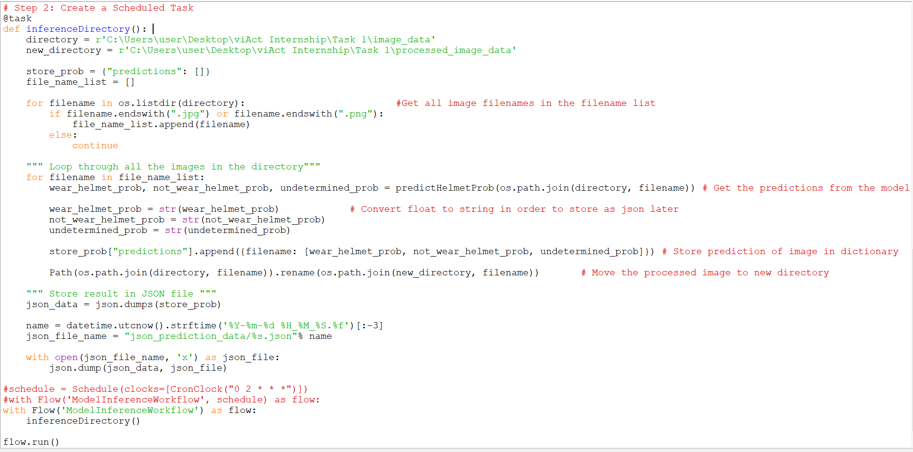
- Originally, the 'image_data' directory looks like this: 
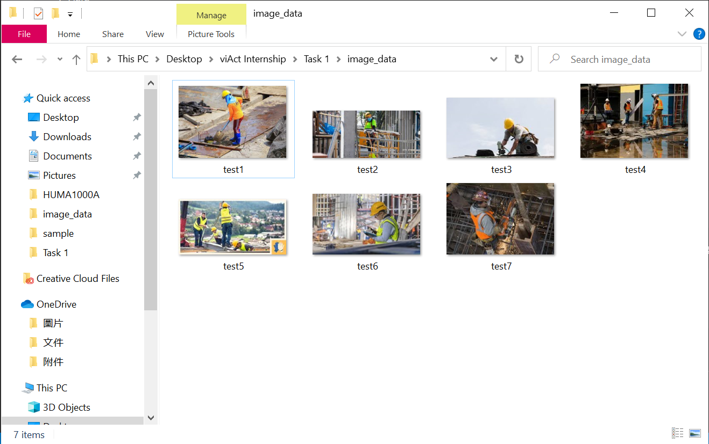 
- The 'processed_image_data' and the 'json_prediction_data' directories are empty.
- The whole folder looks like this:  
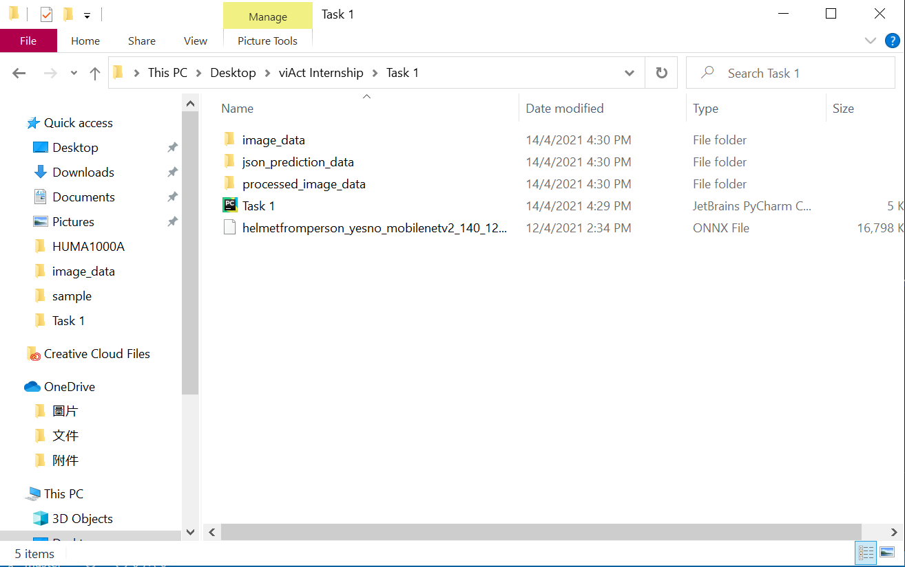  
Here's the test output:  
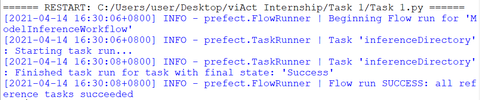 
The images in the 'image_data' folder is moved to the 'processed_image_data' folder:
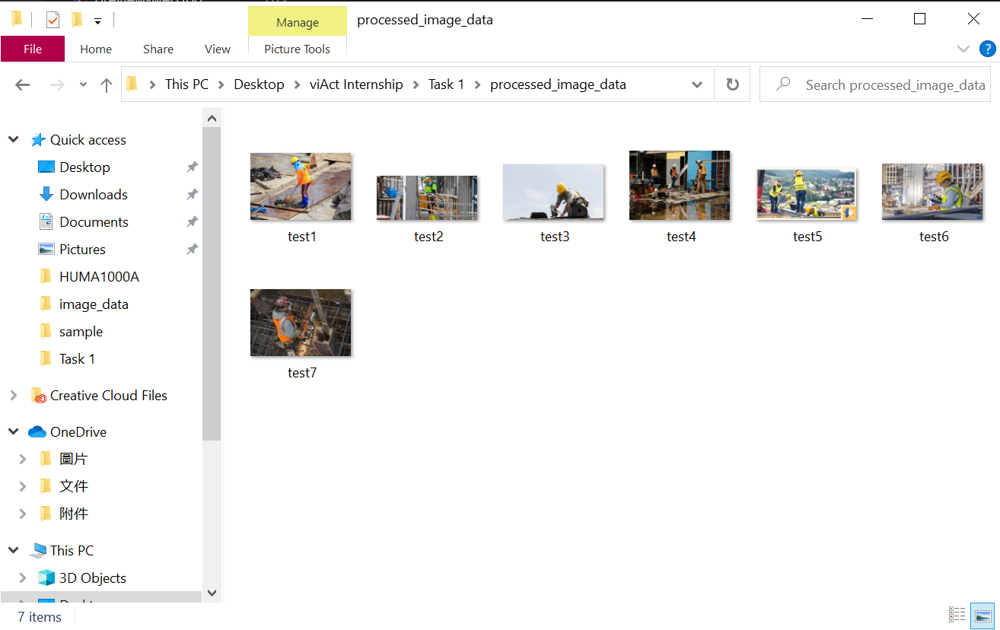 
The result of the predictions is stored in the 'json_prediction_data' folder:
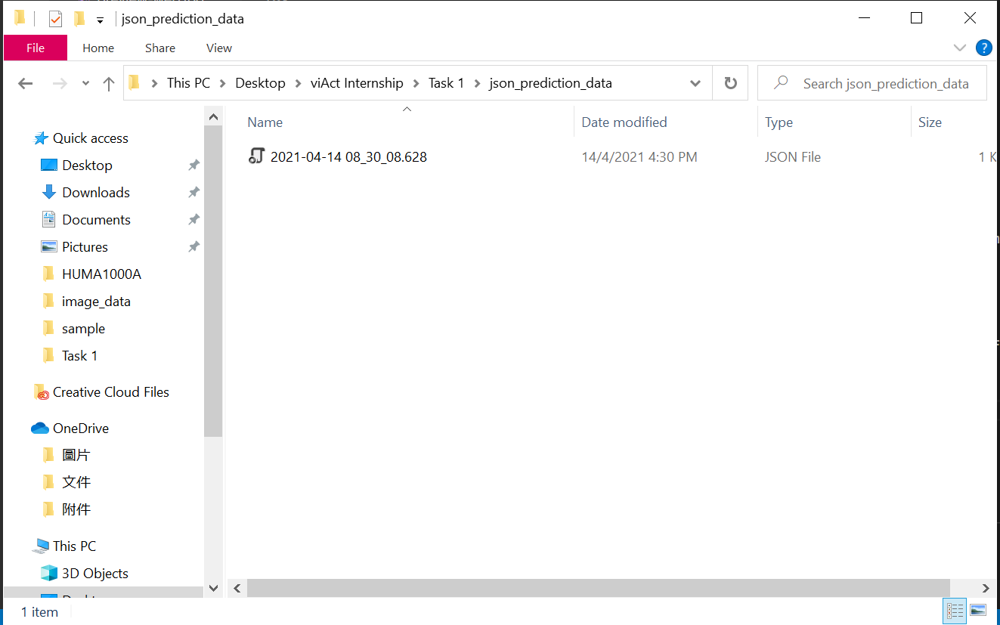 
The json file looks like this:
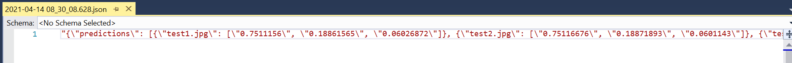